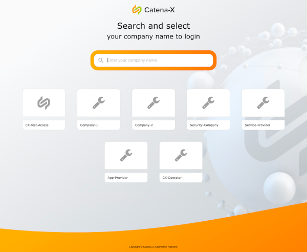

## Getting Started

Check out these links:

* Source Code https://github.com/catenax-ng/product-portal-frontend
* Portal (DEV) https://portal.dev.demo.catena-x.net/
* Portal Shared Components Storybook https://portal.dev.demo.catena-x.net/_storybook/
* Portal Backend API Documentation https://portal.dev.demo.catena-x.net/swagger/

&nbsp;

Here some commands to run the portal on your machine:

    git clone git@github.com:catenax-ng/product-portal-frontend.git
    cd product-portal-frontend
    yarn
    yarn build
    yarn start

&nbsp;

Your browser will open and you should see the central login selection similar to this one.
If not, open it and go to http://localhost:3000/

More content will follow soon ...
